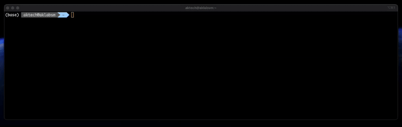

# tlume

<div align="center">


[](https://github.com/aktech/tlume/releases)
[](https://github.com/aktech/tlume/actions/workflows/build.yml)
[](https://github.com/aktech/tlume/actions/workflows/release.yml)
[](https://goreportcard.com/report/github.com/aktech/tlume)
[](https://opensource.org/licenses/MIT)

*Seamlessly convert Tart virtual machines to Lume format with a single command*



</div>

## 🌟 Features

- 🚀 **Fast Conversion**: Convert VMs in seconds with optimized file copying
- 🔄 **Config Translation**: Automatically translates configuration parameters
- 📊 **Progress Tracking**: Real-time progress bars show conversion status
- 💾 **Preserves Data**: Maintains all VM data during the conversion process

## 📦 Installation

### One-Line Install (recommended)

```bash
curl -fsSL https://raw.githubusercontent.com/aktech/tlume/main/install.sh | sh
```

This installer automatically:
- Detects your OS and architecture
- Downloads the appropriate binary
- Installs to your PATH
- Provides setup instructions

### Direct Download

Download the [latest release](https://github.com/aktech/tlume/releases) for your platform.

### From Source

```bash
# Clone the repository
git clone https://github.com/aktech/tlume.git
cd tlume

# Build the binary
go build -o tlume main.go

# Optional: Move to your PATH
sudo mv tlume /usr/local/bin/
```

## 🚀 Usage

Converting a VM is as simple as:

```bash
tlume <machine_name>
```

Example:

```bash
tlume macos-ventura
```

You can also specify a custom disk size with unit suffix:

```bash
tlume -disk-size 100GB macos-ventura  # Set disk size to 100GB
tlume -disk-size 2TB macos-ventura    # Set disk size to 2TB
```

This will:
1. Copy the Tart VM to Lume format
2. Convert the configuration file
3. Make the VM ready to use with Lume

### Options

| Option | Description | Default |
|--------|-------------|---------|
| `-disk-size` | Disk size with unit (e.g., 100GB, 2TB) | 85GB |

## ⚙️ How It Works

`tlume` performs these operations:

1. Locates the Tart VM in `~/.tart/vms/<machine_name>`
2. Creates a Lume VM in `~/.lume/<machine_name>`
3. Copies all VM files with optimized buffering
4. Converts the Tart JSON config to Lume format
5. Adjusts specific parameters (like OS naming from "darwin" to "macOS")

## 🧩 Technical Details

The conversion process preserves:
- VM hardware settings (CPU, memory, disk)
- Network configuration
- Display settings
- Machine identifiers

### Disk Size

By default, tlume sets the disk size to 85GB for converted VMs. Since the Tart configuration doesn't include disk size information, this parameter needs to be explicitly set for Lume. You can modify this using the `-disk-size` flag if your VM requires more or less space. The value can be specified with a unit suffix (e.g., `-disk-size 100GB` or `-disk-size 2TB`), making it more intuitive to use. Supported units are B, KB, MB, GB, and TB. If no unit is specified, GB is assumed. Note that this setting only affects the configuration and doesn't resize the actual disk image.

## 🤝 Contributing

Contributions are welcome! Please feel free to submit a Pull Request.

1. Fork the repository
2. Create your feature branch (`git checkout -b feature/amazing-feature`)
3. Commit your changes (`git commit -m 'Add some amazing feature'`)
4. Push to the branch (`git push origin feature/amazing-feature`)
5. Open a Pull Request

## 📝 License

This project is licensed under the MIT License - see the [LICENSE](LICENSE) file for details.

## 💖 Acknowledgments

- [Tart](https://tart.run/) - macOS VMs for Apple Silicon
- [Lume](https://github.com/trycua/cua/tree/main/libs/lume) - Lightweight macOS VM manager
- [schollz/progressbar](https://github.com/schollz/progressbar) - For the awesome progress bar
